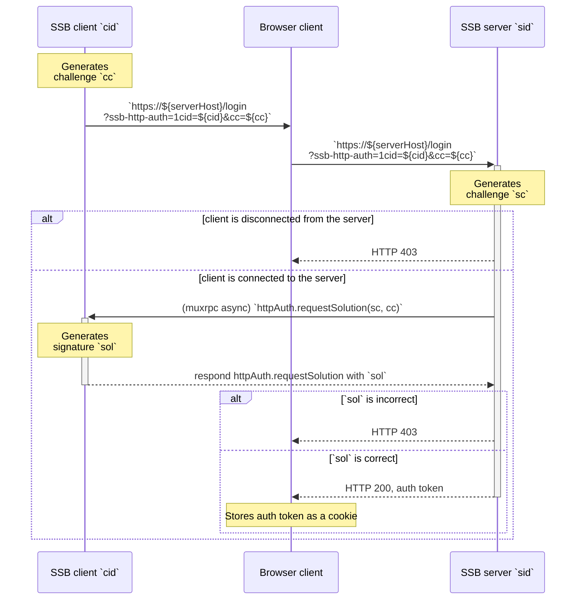

## Client-initiated protocol

In the client-initiated variant of the challenge-response protocol, the first step is the client creating `cc` and opening a web page in the browser. Then, the server attending to that HTTP request will call `httpAuth.requestSolution(sc, cc)` on the client SSB peer.

The UML sequence diagram for the whole client-initial protocol is shown below:

