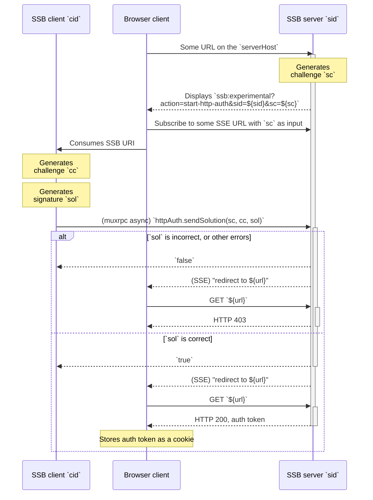

## Server-initiated protocol

In the server-initiated variant of the challenge-response protocol, the first step is the browser requesting a login from the server without any input data. The server answers the browser, which in turn displays an SSB URI which the SSB peer knows how to open.

The primary difference between this variant and the previous one is that the muxrpc async RPC call direction is reversed. Previously, the server called `httpAuth.requestSolution` **on the client**. In this variant, the client calls `httpAuth.sendSolution` **on the server**. The response is also different. In the previous case, the client's response is expected to be the `sol`. In this variant, the `sol` argument is provided by the client and the server's response is expected to be `true`.

The secondary difference with this variant is the addition of [Server-Sent Events](https://html.spec.whatwg.org/multipage/server-sent-events.html) (SSE) between the browser and the server, to update the browser when the muxrpc protocol succeeds.

The UML sequence diagram for the whole server-initial protocol is shown below:



The SSB URI **MAY** also contain the query parameter `multiserverAddress` with value `msaddr` matching the server's multiserver address, in case the client does not know how to map the server's `sid` to a multiserver address in order to call the muxrpc `http.sendSolution`:

```
ssb:experimental?action=start-http-auth&sid=${sid}&sc=${sc}&multiserverAddress=${msaddr}
```