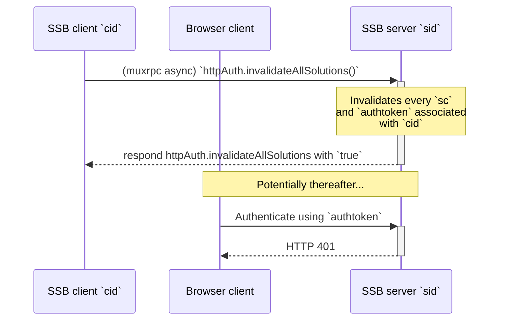
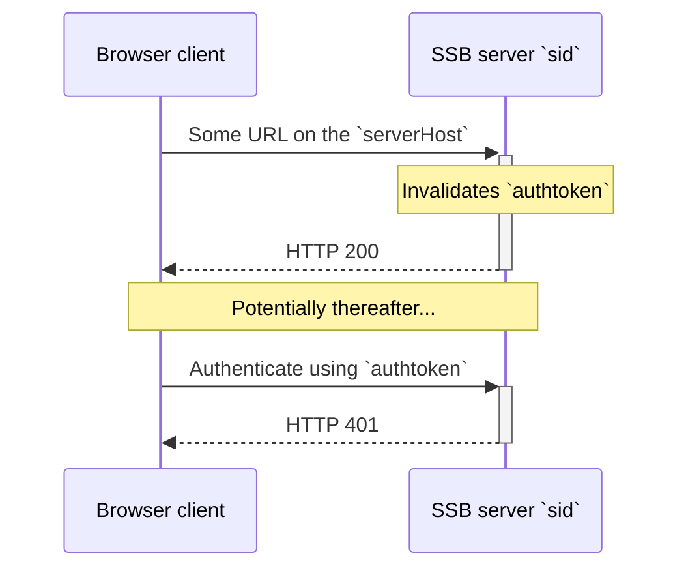

<!--
SPDX-FileCopyrightText: 2021 Andre 'Staltz' Medeiros

SPDX-License-Identifier: CC-BY-4.0
-->

## Sign-out

An optional (but recommended) muxrpc API `httpAuth.invalidateAllSolutions` on the server to allow the SSB peer to invalidate *all* auth tokens associated with the `cid`. See UML sequence diagram:

The browser client also has the option of signing out with HTTP endpoints. This does not require a muxrpc call with the SSB peer. See UML sequence diagram:

